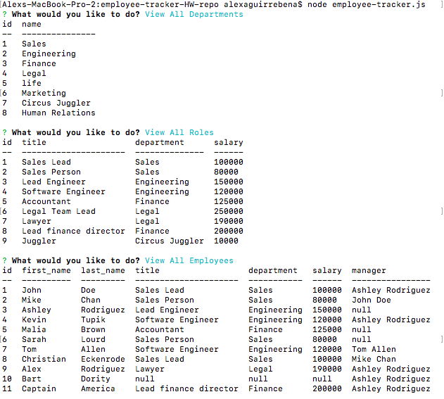
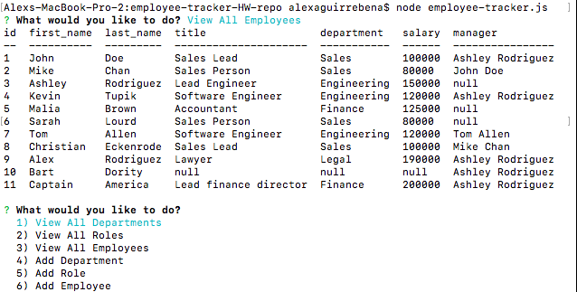

# employee-tracker-HW-repo

Employee tracker is a command-line application for managing a company's employees using node, inquirer, and MySQL. This is an interface that makesit easy for non-developers to view and interact with information stored in databases.

To complete this assignment I had to design the following database schema containing three tables, below is a wire frame example: 

This command line interface allow employers to organize their employee database and keep their staff, departments, staff ID's and roles in a computer database. Below there will be a series of screenshots of how the app works and general layout followed by a short demo.

First we have a screenshot of how all three tables look within the command line terminal:

Next we have a screenshot of the list of company employees and their departments, roles, salaries, and their managers. If they don't have a manager that field returns null:

Lastly, I will showcase a demo with a reference scrrenshot on the right to show the fields are in fact being changed also:

